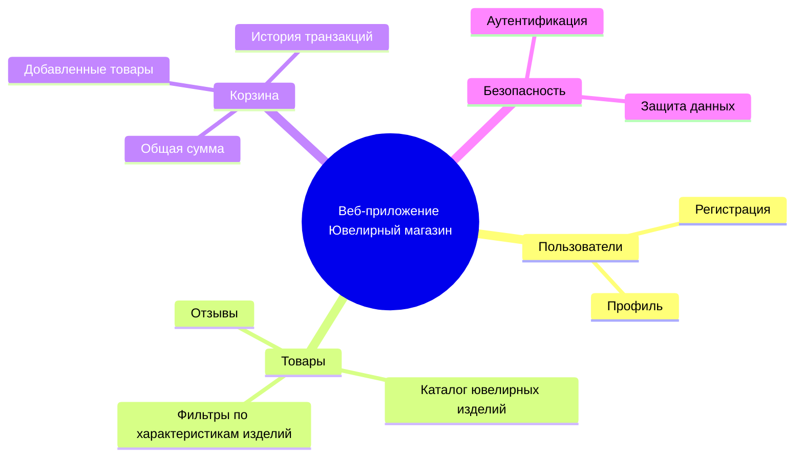
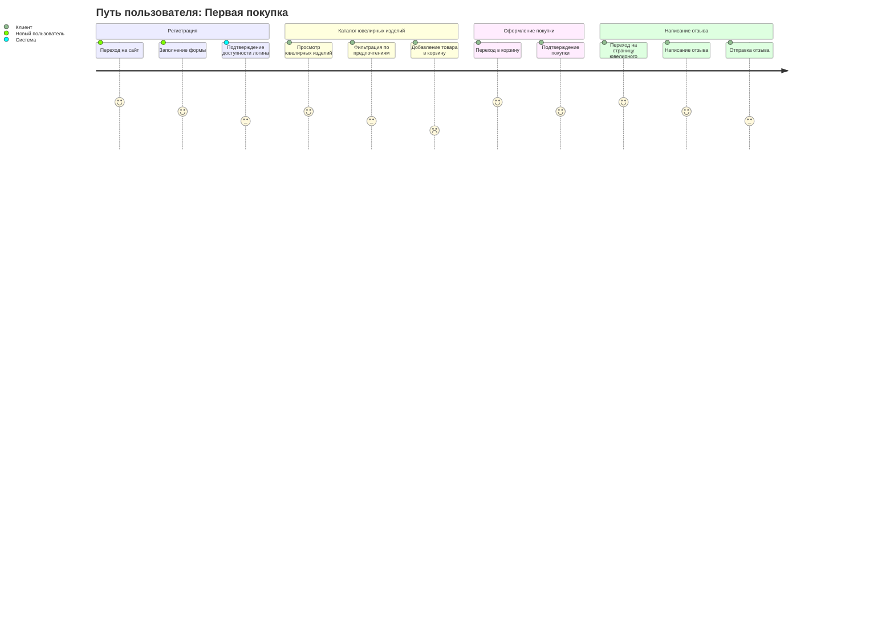
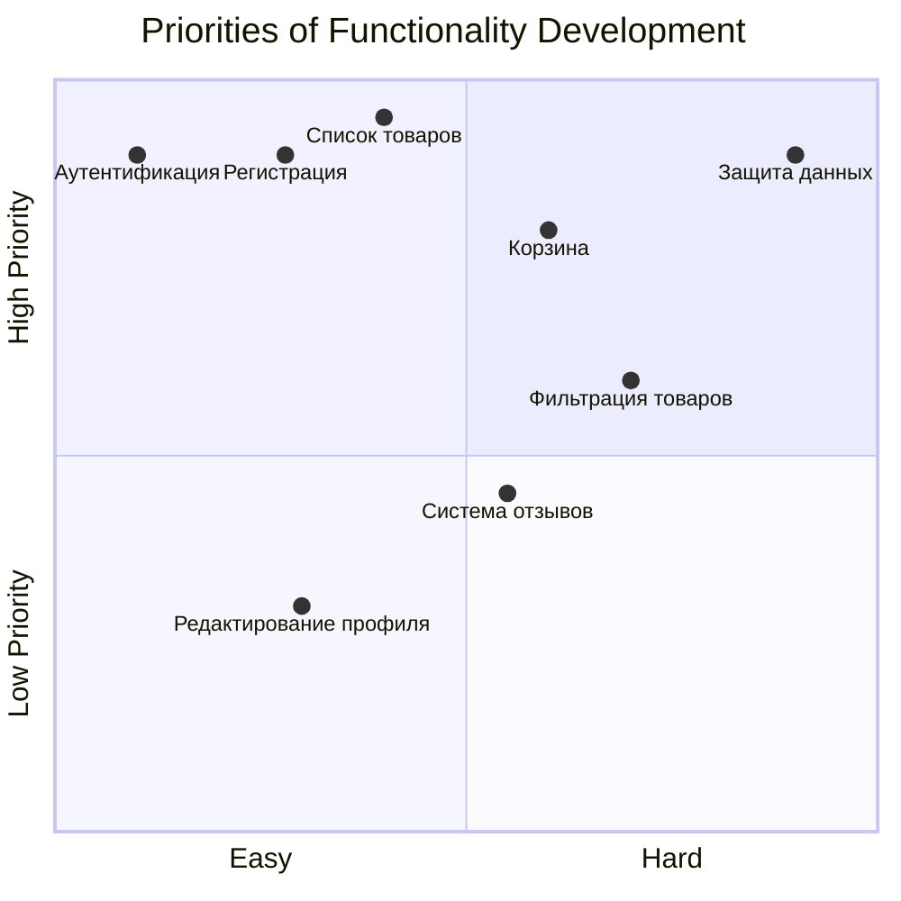
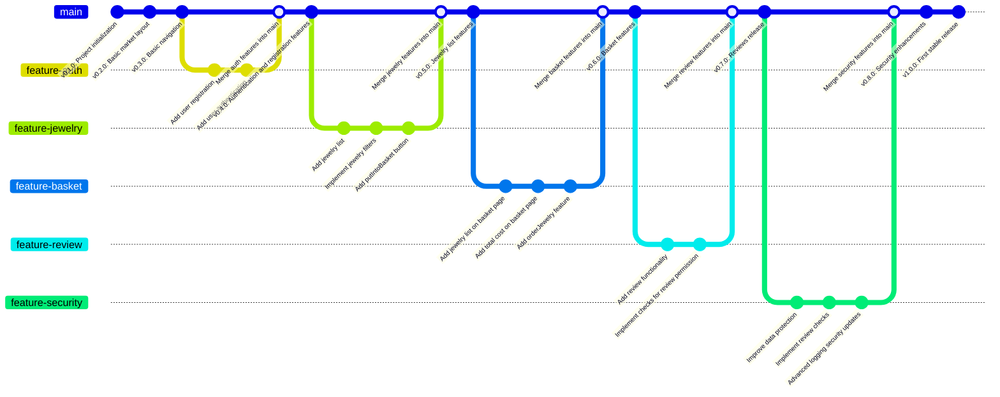

# Документирование приложения интернет-магазина ювелирных изделий

## 1. Структура функциональных возможностей (Mind Map)

### Описание:

Эта диаграмма иллюстрирует структуру функциональных возможностей для интернет-магазина ювелирных изделий.

### Основные узлы и их значение:

* <u>Пользователи:</u> функционал, связанный с управлением учетными записями.

* <u>Товары:</u> доступные для покупки изделия.

* <u>Корзина:</u> добавленные для покупки изделия

* <u>Безопасность:</u> безопасная передача данных пользователей

## 2. Диаграмма путешествия пользователя (User Journey Diagram)

### Описание:

Диаграмма описывает ключевые этапы взаимодействия пользователя с системой:

* Регистрация: пользователь создает учетную запись.

* Каталог ювелирных изделий: пользователь просматривает доступные товары и добавляет в корзину.

* Оформление покупки: пользователь совершает заказ

* Написание отзыва: пользователь описывает свои впечатления от заказа

## 3. Квадрант-граф (Prioritization Quadrant)

### Описание:

Квадрант-граф помогает приоритизировать разработку функций системы. Каждая точка соответствует функционалу:

* Ось X: сложность реализации (от простого к сложному).

* Ось Y: приоритет для пользователей (от низкого к высокому).

## 4. Гит граф (Gitgraph)

### Описание:

 Гит-граф показывает процесс разработки системы через версии:

1. Основная ветка (main): стабильные версии системы.

2. Функциональные ветки: каждая ветка посвящена отдельной функциональности (список изделий, корзина и т.д.).

3. Слияния: после завершения работы над веткой, изменения интегрируются в main.
